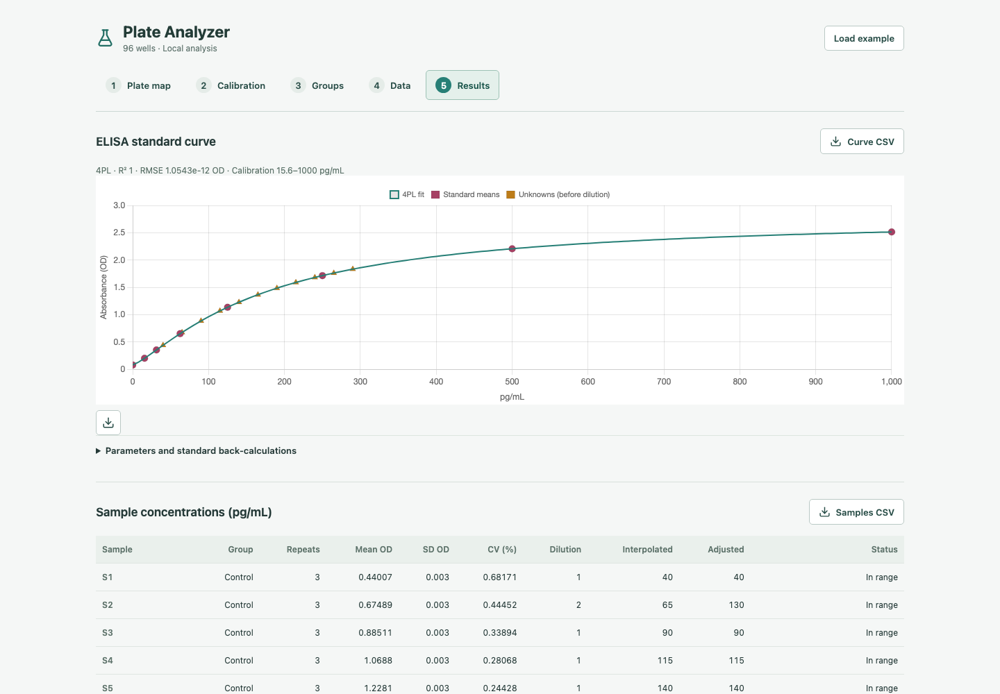

# 96-Well Plate Analyzer

[Live demo](https://naomijnguyen.github.io/plate-analyzer/) · [Portfolio project](https://www.naomijnguyen.com/docs/plate-analyzer) · [Calculation notes](docs/TECHNICAL.md) · [Architecture and hosting](docs/ARCHITECTURE.md)

I started this as a quick prototype to make plate data easier to work with: map the wells, define the groups, and get a graph without rebuilding the same spreadsheet each time. This version adds an ELISA calibration workflow and keeps the underlying well readings available alongside the results.



## What it does

- Keeps plate maps separate from instrument readings, with CSV/TSV map import and editable wells.
- Fits an increasing-response 4PL standard curve, interpolates unknown samples, and applies dilution factors.
- Combines technical repeats by sample ID before group comparisons. Each circle represents one sample, not one well.
- Provides a separate **Graphs** page with group mean bars and individual sample points on by default, SD error bars by default, and selectable SEM or no error bars.
- Keeps descriptive statistics and statistical comparisons on **Results**, including the selected test, groups, p-value, statistic, degrees of freedom, and adjustment status. Calculated comparisons also annotate the graph.
- Exports well readings, concentrations, curve diagnostics, group summaries, and PNG graphs. Out-of-range samples stay visible and flagged.

Everything runs in the browser. Plate data is not uploaded to an analysis service, and there are no API keys or model calls. Working data is held in memory, so refresh clears it; export results before leaving. The hosting provider still serves the site and handles normal web requests.

## Try it

Open the [demo](https://naomijnguyen.github.io/plate-analyzer/) or run the app locally, choose **Group comparison** or **ELISA quantification**, and select **Load example**. Both examples are synthetic. The ELISA example includes a diluted sample and an out-of-range sample.

For your own plate, enter or import sample IDs on **Plate map**, then paste the separate 8 x 12 reading grid on **Data**. Technical repeats share an ID. Groups accept lists or ranges such as `S1-S6, S9`. ELISA standard IDs, known concentrations, and sample dilution factors live on **Calibration**. Excel ranges can be pasted or exported as CSV/TSV; native workbook import is not included.

After **Analyze**, **Results** contains the summary tables, statistical comparison controls, heatmap, and contributing wells. Select **Graphs** or **Open graphs** for the dedicated graph workspace and PNG export. Returning to Results preserves both the calculation and graph settings. Editing analysis inputs invalidates both pages until you analyze again; settings persist only for the current browser session.

P-values are not calculated automatically from raw readings: choose the existing Welch unpaired t-test or one-way ANOVA and confirm the assumptions for your experimental design. Technical repeats are averaged first. Until a test runs successfully, Results explicitly says the p-value has not been calculated. ANOVA is an omnibus test, not a set of pairwise comparisons; current p-values have no multiple-comparison adjustment. Paired tests and adjusted post-hoc comparisons are not implemented in this refactor.

## Run locally

Use Node.js 22.13 or newer and npm.

```sh
npm ci
npm run dev
```

Open the address printed by Vite. To check or build it:

```sh
npm test
npm run build
npx playwright install chromium
npm run test:browser
```

The browser tests build and exercise the production app on desktop and phone-sized viewports. GitHub Actions checks pushes and pull requests, then deploys successful `main` builds to Pages. A separate `npm run build:portfolio` prepares assets for `/apps/plate-analyzer/` if we later self-host the app. That alternative route is not live. Hosting and embedding details are in [Architecture](docs/ARCHITECTURE.md).

## Decisions worth a look

Missing readings are rejected rather than shifted into neighboring wells. Editing inputs clears old results. ELISA calculations average repeat OD before nonlinear interpolation, then apply the dilution factor once. Out-of-range readings are not extrapolated or substituted with zero.

The [calculation notes](docs/TECHNICAL.md) cover fitting bounds, standard recovery, repeat handling, test assumptions, and exports. The [tests](tests) include synthetic recovery checks and numerical fixtures independently calculated with SciPy. This is a research prototype, not a validated assay-analysis package; the next comparison is a real de-identified plate analyzed with the same settings in an established tool.

## Tech stack

Start with [plate parsing and group statistics](src/analysis.js), [ELISA fitting](src/elisa.js), or [workflow state](src/PlateAnalyzer.jsx). [GraphsPage](src/GraphsPage.jsx) owns the graph workspace layout and controls; [ResultsChart](src/ResultsChart.jsx) is the reusable plotting module. Both pages consume the same result snapshot from the analysis modules; graph settings never recalculate statistics. Calibration controls remain separate components under `src/`.

React/React DOM power the interface; Chart.js handles plotting; Papa Parse reads CSV/TSV; simple-statistics, jStat, and ml-levenberg-marquardt handle the math; Lucide supplies icons. Vite builds the app, and Playwright checks the browser workflows. Installed versions are recorded in `package-lock.json`. Python is not required to run or test the app.

## Credits and history

Since 2025, I’ve been making software in active collaboration with AI coding systems across providers, and I want to do more of it. I built the original Plate Analyzer with Claude from Anthropic and developed the 1.2.0 revision with Codex from OpenAI, working together on the product workflow, calculations, tests, and interface. See the [changelog](CHANGELOG.md).

The [BioLegend CXCL10/IP-10 protocol](https://www.biolegend.com/Files/Images/media_assets/pro_detail/datasheets/439904_V02_JYH.pdf) was a reference for the ELISA workflow. All bundled readings and screenshots are synthetic; no vendor endorsement is implied. The original [MIT license](LICENSE) is preserved.
